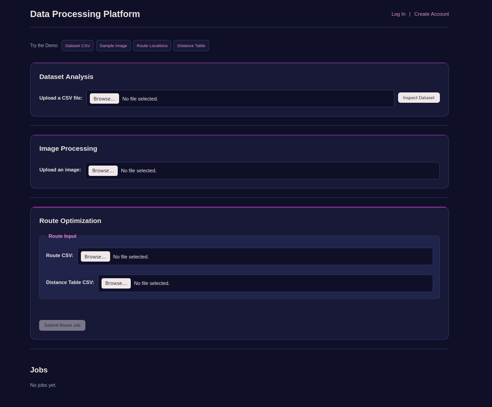

# Data Processing Platform

A web platform for submitting asynchronous data-processing jobs — dataset analysis & ML, image processing, and route optimization — built with a Go API and worker pool, Redis Streams, PostgreSQL, and a Terraform-managed AWS deployment.

**Live demo:** [app.bunnell.app](https://app.bunnell.app)




---

## What it does

Users submit CSV datasets, images, or route/distance data through a web UI. Jobs are queued and processed asynchronously by a pool of Go workers, which dispatch to Python processors for the actual analysis. Results — including generated models, visualizations, and optimized routes — are persisted to object storage and served back through the app.

## Highlights

- **Real async architecture** — Go HTTP API and a separate worker pool communicate over Redis Streams, with atomic PostgreSQL job claiming, pending-job recovery, and bounded retries
- **Three distinct processing pipelines** — dataset analysis + Random Forest modeling, image processing with Pillow, and nearest-neighbor + 2-opt route optimization, all sharing one job/worker system
- **Accounts + guest sessions** — secure server-side sessions, per-user/per-session job isolation, and guest-to-account job transfer on registration
- **Deployed and running on AWS** — EC2, RDS, S3, IAM, and Secrets Manager, provisioned entirely through Terraform with remote state locking
- **Full observability** — Prometheus metrics and Grafana dashboards for job throughput, queue depth, latency percentiles, and error rates
- **CI/CD pipeline** — GitHub Actions runs Go/Python tests and Terraform validation, builds ARM64 Docker images, publishes to Amazon ECR, and auto-deploys to EC2 via AWS Systems Manager
- **Benchmarked** — worker throughput and latency were measured under load (see below)

## Performance

Worker throughput was benchmarked under a fixed 100ms processing workload:

| Workers | Throughput | Avg Queue Latency | Avg Total Latency |
|---:|---:|---:|---:|
| 1 | 9.9 jobs/sec | 1.47 s | 1.57 s |
| 2 | 19.8 jobs/sec | 718 ms | 818 ms |
| 3 | 29.6 jobs/sec | 466 ms | 567 ms |

Adding workers produced near-linear throughput scaling in this benchmark while reducing queue latency.

## Tech Stack

| Layer | Technology |
|---|---|
| API & workers | Go |
| Job processing | Python (dataset/ML, image, route processors) |
| Persistent state | PostgreSQL |
| Async queue | Redis Streams |
| Object storage | Local filesystem (dev) / Amazon S3 (prod) |
| Infrastructure | Terraform, Docker, AWS (EC2, RDS, S3, IAM, Secrets Manager, CloudWatch) |
| Monitoring | Prometheus, Grafana |
| CI/CD | GitHub Actions, Amazon ECR, AWS Systems Manager |

## Architecture

```text
Browser
   │
   ▼
Go HTTP server ───── PostgreSQL
   │                    ▲
   ├── Redis Streams ────┤
   │        │            │
   │        ▼            │
   │   Go worker pool ───┘
   │        │
   │        ▼
   │   Python processors
   │
   └──────────── Object storage
                  (local / S3)
```

The API and worker pool are separate Go processes with no direct process-to-process communication. They coordinate asynchronously through Redis Streams and share PostgreSQL state and object storage, allowing the worker pool to scale independently of the API. In production this runs on EC2 behind Caddy, with Amazon RDS for PostgreSQL, Amazon S3 for storage, and Prometheus/Grafana for monitoring — all provisioned via Terraform.

Full architecture diagrams and design rationale: [docs/full_readme.md](docs/full_readme.md#architecture)

## Quick Start

Requirements: Docker and Docker Compose

```bash
docker compose up -d --build
```

This starts the Go API, worker pool (3 replicas), PostgreSQL, Redis, Prometheus, and Grafana. The app is available at `http://localhost:8082`.

For host-based development, environment variables, and Amazon S3 configuration, see the [full setup guide](docs/full_readme.md#running-locally).

## Testing

```bash
go test ./...                          # Go unit + integration tests
cd processors/dataset && pytest -v     # dataset processor
cd processors/image && pytest -v       # image processor
cd processors/route && pytest -v       # route processor
```

Test coverage includes authentication and authorization, cross-user access prevention, concurrent job claiming, worker crash recovery, and queue backpressure. Details: [docs/full_readme.md](docs/full_readme.md#testing)

## Documentation

- [**Full technical reference**](docs/full_readme.md) — the complete feature list, architecture, deployment, and testing documentation
- [Development and Design](docs/data_processing_platform.md)
